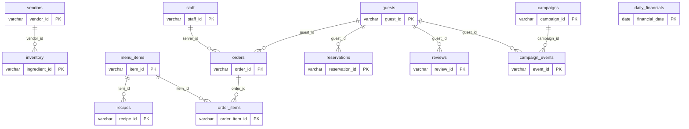

# synthetic-data

Quickly generate fake or synthetic data to use in example projects, MVPs, tests, etc.

Uses Python (Faker, Polars, Pydantic) and information from the web to generate realistic synthetic datasets. All output is zstd-compressed Parquet, optimized for DuckDB and MotherDuck.

## Examples

### Frying Nemo — Seafood Restaurant

Full operational data for a fictional seafood restaurant: 13 tables, 2 years (2024-2025), ~370K total rows.

```bash
python frying-nemo/generate.py
```



See [`frying-nemo/README.md`](frying-nemo/README.md) for the full data model, column details, and example SQL joins.

## Structure

Each example is a top-level folder with its own generator and output:

```
frying-nemo/          # Seafood restaurant — staff, sales, inventory, reviews, etc.
  generate.py         # Run to produce parquet files
  *.parquet           # Generated output (gitignored)
  README.md           # Data model, ER diagram, example joins
```

## Getting Started

```bash
uv venv && uv pip install -e ".[dev]"
python frying-nemo/generate.py
```

## Claude Code Skills

- `/data-design` — Interactively design a synthetic data schema for a new example
- `/upload-to-motherduck [folder]` — Upload parquet files to MotherDuck
- `/ship [commit message]` — Stage, commit, push, and open a PR

## Tech Stack

- **Python 3.10+** with Faker, Polars, Pydantic
- **Parquet** (zstd compression) for all output
- **DuckDB / MotherDuck** as the target analytical database
