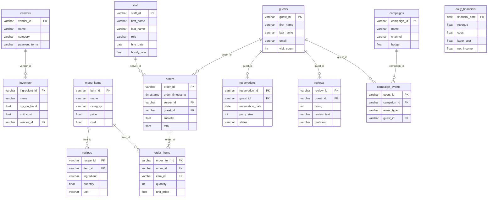

# Frying Nemo

A fictional seafood restaurant. Generates 2 years (2024-2025) of synthetic operational data covering staff, menu, inventory, sales, guests, reviews, marketing, and financials.

## Generate

```bash
python frying-nemo/generate.py
```

## Data Model

### `vendors`
| Column | Type | Description |
|--------|------|-------------|
| vendor_id | VARCHAR | Primary key (VND-XXXX) |
| name | VARCHAR | Company name |
| contact_name | VARCHAR | Sales rep name |
| contact_email | VARCHAR | Sales rep email |
| contact_phone | VARCHAR | Phone number |
| category | VARCHAR | seafood, produce, dairy, dry_goods, beverages, equipment, supplies |
| payment_terms | VARCHAR | net_15, net_30, net_60, cod |

### `staff`
| Column | Type | Description |
|--------|------|-------------|
| staff_id | VARCHAR | Primary key (STF-XXXX) |
| first_name | VARCHAR | First name |
| last_name | VARCHAR | Last name |
| role | VARCHAR | chef, sous_chef, line_cook, prep_cook, server, host, bartender, manager, dishwasher, busser |
| hire_date | DATE | Date hired |
| hourly_rate | FLOAT | Pay rate |
| is_active | BOOLEAN | Currently employed |

### `menu_items`
| Column | Type | Description |
|--------|------|-------------|
| item_id | VARCHAR | Primary key (MNU-XXXX) |
| name | VARCHAR | Dish name |
| category | VARCHAR | appetizer, entree, dessert, side, drink, kids |
| price | FLOAT | Menu price |
| cost | FLOAT | Ingredient cost (~30% of price) |
| is_active | BOOLEAN | Currently on menu |

### `recipes`
| Column | Type | Description |
|--------|------|-------------|
| recipe_id | VARCHAR | Primary key (RCP-XXXX) |
| item_id | VARCHAR | FK -> menu_items |
| ingredient | VARCHAR | Ingredient name |
| quantity | FLOAT | Amount needed |
| unit | VARCHAR | oz, lb, g, cup, tbsp, tsp, each, ml |

### `inventory`
| Column | Type | Description |
|--------|------|-------------|
| ingredient_id | VARCHAR | Primary key (ING-XXXX) |
| name | VARCHAR | Ingredient name |
| unit | VARCHAR | Unit of measure |
| qty_on_hand | FLOAT | Current stock |
| reorder_point | FLOAT | Reorder threshold |
| unit_cost | FLOAT | Cost per unit |
| vendor_id | VARCHAR | FK -> vendors |
| last_ordered | DATE | Last purchase date |

### `guests`
| Column | Type | Description |
|--------|------|-------------|
| guest_id | VARCHAR | Primary key (GST-XXXX) |
| first_name | VARCHAR | First name |
| last_name | VARCHAR | Last name |
| email | VARCHAR | Email (nullable, ~30% NULL) |
| phone | VARCHAR | Phone (nullable, ~20% NULL) |
| visit_count | INT | Total visits |
| first_visit | DATE | First visit date |
| last_visit | DATE | Most recent visit |

### `reservations`
| Column | Type | Description |
|--------|------|-------------|
| reservation_id | VARCHAR | Primary key (RSV-XXXX) |
| guest_id | VARCHAR | FK -> guests |
| reservation_date | DATE | Date of reservation |
| reservation_time | VARCHAR | Time slot (17:00-20:30) |
| party_size | INT | Number of guests |
| status | VARCHAR | confirmed, seated, completed, no_show, cancelled |
| notes | VARCHAR | Special requests (nullable) |

### `orders`
| Column | Type | Description |
|--------|------|-------------|
| order_id | VARCHAR | Primary key (ORD-XXXX) |
| order_timestamp | TIMESTAMP | Order date/time (lunch 11:30-14:00, dinner 17:00-21:30) |
| table_number | INT | Table 1-20 |
| server_id | VARCHAR | FK -> staff |
| guest_id | VARCHAR | FK -> guests (nullable, ~30% walk-ins) |
| payment_method | VARCHAR | credit_card, debit_card, cash, gift_card |
| subtotal | FLOAT | Pre-tax total |
| tax | FLOAT | 8% tax |
| tip | FLOAT | ~18% average tip |
| total | FLOAT | subtotal + tax + tip |

### `order_items`
| Column | Type | Description |
|--------|------|-------------|
| order_item_id | VARCHAR | Primary key (OIT-XXXX) |
| order_id | VARCHAR | FK -> orders |
| item_id | VARCHAR | FK -> menu_items |
| quantity | INT | Number ordered |
| unit_price | FLOAT | Price at time of order |
| modifiers | VARCHAR | Special instructions (nullable) |

### `reviews`
| Column | Type | Description |
|--------|------|-------------|
| review_id | VARCHAR | Primary key (REV-XXXX) |
| guest_id | VARCHAR | FK -> guests (nullable) |
| review_date | DATE | Date posted |
| rating | INT | 1-5 (skewed positive, mean ~4.0) |
| review_text | VARCHAR | Review body |
| platform | VARCHAR | google, yelp, tripadvisor, internal |

### `campaigns`
| Column | Type | Description |
|--------|------|-------------|
| campaign_id | VARCHAR | Primary key (CMP-XXXX) |
| name | VARCHAR | Campaign name |
| channel | VARCHAR | email, instagram, facebook, sms, local_print |
| start_date | DATE | Campaign start |
| end_date | DATE | Campaign end |
| budget | FLOAT | Total spend |
| target_audience | VARCHAR | Audience segment |

### `campaign_events`
| Column | Type | Description |
|--------|------|-------------|
| event_id | VARCHAR | Primary key (EVT-XXXX) |
| campaign_id | VARCHAR | FK -> campaigns |
| event_type | VARCHAR | send, open, click, conversion, unsubscribe |
| event_timestamp | TIMESTAMP | When the event occurred |
| guest_id | VARCHAR | FK -> guests (nullable) |

### `daily_financials`
| Column | Type | Description |
|--------|------|-------------|
| financial_date | DATE | Primary key |
| revenue | FLOAT | Total daily revenue (from orders) |
| cogs | FLOAT | Cost of goods sold (from order_items + menu_items cost) |
| labor_cost | FLOAT | Daily labor estimate |
| rent | FLOAT | Daily rent (~$8,500/mo) |
| utilities | FLOAT | Daily utilities (~$2,200/mo) |
| marketing_spend | FLOAT | Daily marketing (from campaigns) |
| other_expenses | FLOAT | Miscellaneous |
| net_income | FLOAT | revenue - all expenses |

## Relationships



> `daily_financials` is derived/aggregated from orders, staff, and campaigns — no direct FK relationships.

## Common Joins

```sql
-- Order details with item names and server
SELECT o.order_id, o.order_timestamp, s.first_name AS server,
       m.name AS item, oi.quantity, oi.unit_price
FROM orders o
JOIN staff s ON o.server_id = s.staff_id
JOIN order_items oi ON o.order_id = oi.order_id
JOIN menu_items m ON oi.item_id = m.item_id;

-- Guest history with reservations and reviews
SELECT g.first_name, g.last_name, g.visit_count,
       r.reservation_date, r.party_size,
       rv.rating, rv.review_text
FROM guests g
LEFT JOIN reservations r ON g.guest_id = r.guest_id
LEFT JOIN reviews rv ON g.guest_id = rv.guest_id;

-- Daily P&L summary
SELECT financial_date, revenue, cogs, labor_cost,
       revenue - cogs - labor_cost AS gross_margin,
       net_income
FROM daily_financials
ORDER BY financial_date;

-- Campaign funnel analysis
SELECT c.name, c.channel,
       COUNT(*) FILTER (WHERE ce.event_type = 'send') AS sends,
       COUNT(*) FILTER (WHERE ce.event_type = 'open') AS opens,
       COUNT(*) FILTER (WHERE ce.event_type = 'click') AS clicks,
       COUNT(*) FILTER (WHERE ce.event_type = 'conversion') AS conversions
FROM campaigns c
JOIN campaign_events ce ON c.campaign_id = ce.campaign_id
GROUP BY ALL;

-- Food cost analysis by menu category
SELECT m.category, AVG(m.cost / m.price) AS avg_food_cost_pct
FROM menu_items m
GROUP BY m.category
ORDER BY avg_food_cost_pct DESC;
```
